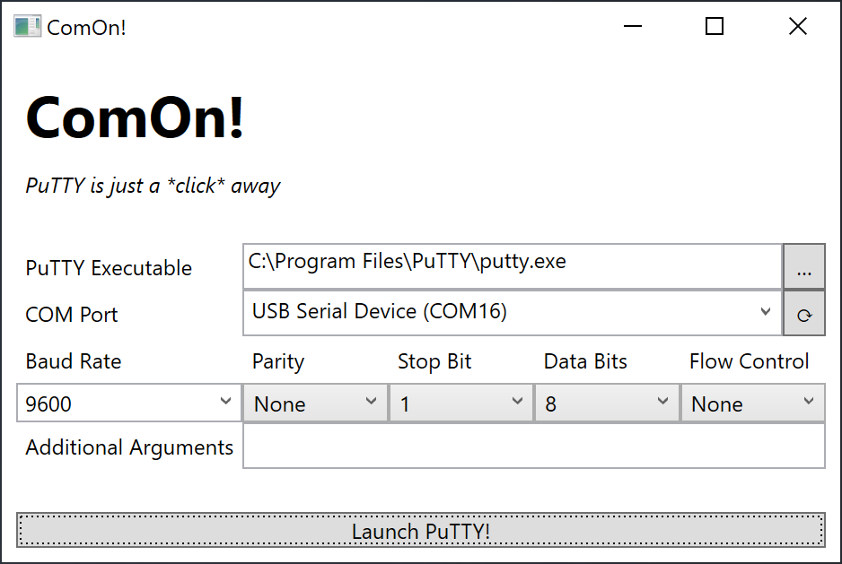

# ComOn!

PuTTY is just a *click* away.

PuTTY is a good tool, but not so good a software in the context of user experience. I frequently need to access serial ports on Windows, and 2 major problems of PuTTY continuously haunted me:

* There is no serial port list, so I need to launch `devmgmt.msc` to look up COM# numbers every time (this require UAC elevation)
* When PuTTY window is closed, the connection settings are not remembered

ComOn! is designed to partially solve these 2 problems.

## Usage

Requirements:

* .net Framework 4.6.2
* `putty.exe` in `PATH`

The UI is self-explanatory.

